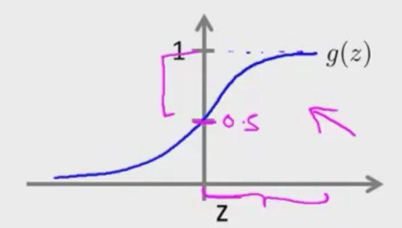
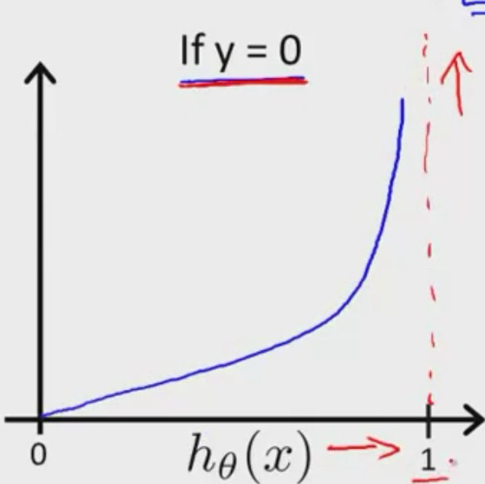
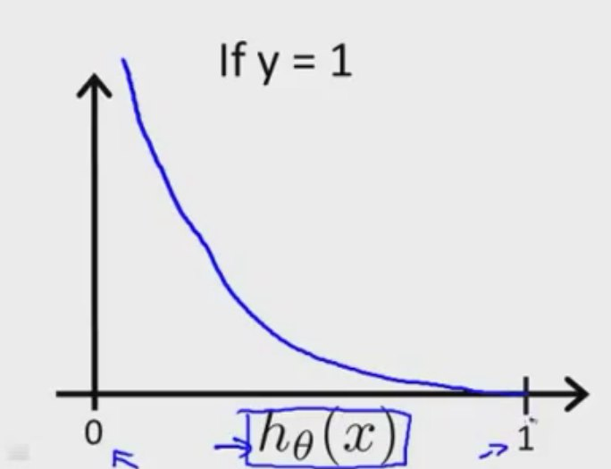

# Classification with Logistic Regression

y is a value in {0, 1}, so we want 0 <= hθ(x) <= 1
hθ(x) = g(θT * X)
g(z) = 1 / ( 1 + e^(-z) )

*Sigmoid function* or *Logistic function*

We can't use linear regression because it can return values outside of 0-1, and depending on the X values, 

hθ(x) = estimated probability that y = 1 on input x
hθ(x) = p(y=1|x;θ) _probability that y = 1, given x, parameterized by θ_

g(z) >= 0.5 whenever z >= 0
hθ(x) = g (θT * X) >= 0 whenever θT * X >= 0

## Decision boundary

Property of a hypothesis that, from it onwards, we would predict y = 1

### Non-linear decision boundaries

Polynomials hypothesis functions

i.e. hθ(x) = g(θ0 + θ1x1 + θ2x2 + θ3 * x1^2 + θ4 x2^2)

Decision boundary is a circle

Higher order polynomial functions can generate decision boundaries with different, more complex shapes

## Cost function

J(θ) = 1/m ∑ Cost(hθ(xi), yi)
Cost(hθ(x), y) = { -log(hθ(x))     if y = 1
                   -log(1 - hθ(x)) if y = 0 }

This is a convex optimization problem

Can be made compact:

Cost(hθ(x), y) = -y(log(hθ(x)) - (1-y)log(1 - hθ(x)))

As the first term gets cancelled if y = 0, and the second term gets cancelled when y = 1

We take the negative sign outside:

J(θ) = - 1/m [∑ yi * log(hθ(xi)) + (1 - yi) * log(1 - hθ(xi))]

## Gradient descent

Partial derivative of J(θ) is:

1/m ∑ (hθ(xi) - yi) * x(j)i

so:

θj := θj - α * (1 / m) * ∑((hθ(xi) - yi) * x(j)i)

### Other optimization algorithms

- Conjugate descent
- BFGS
- L-BFGS

In Octave, use `fminunc`

Very complex, so use libraries

## Multiclass Classification

### One vs all

hθi(x) for each class i to predict the probability that y = i

On new input x, pick the class i that maximizes hθi(x)

# Regularization

We sometimes have the problem of overfitting, using a very high order polynomial when a quadratic function is more than enough, and possible even more precise.

Regularization penalizes θ parameters

J(θ) = (1 / (2 * m)) * [∑(hθ(xi) - yi) ^ 2 + ∑ λ * θj^2]

If λ is too large, it can result in underfitting

## Linear regression

### Gradient descent

θ0 := θ0 - α * (1 / m) * ∑((hθ(xi) - yi) * x(0)i)

θj := θj - α * [(1 / m) * ∑((hθ(xi) - yi) * x(j)i) + λ/m * θj]

Which can be put together as:

θj := θj * (1 - α * (λ/m)) - α * (1 / m) * ∑((hθ(xi) - yi) * x(j)i)

### Normal equation

θ = ((XT * X + λ * MAT) ^ (−1)) XT * y

MAT: Almost identity matrix with a 0 at position 1-1

As long as λ > 0, the matrix will be invertible

## Logistic regression

J(θ) = - 1/m [∑ yi * log(hθ(xi)) + (1 - yi) * log(1 - hθ(xi))] + ∑ λ * θj^2

### Gradient descent

θ0 := θ0 - α * (1 / m) * ∑((hθ(xi) - yi) * x(0)i)

θj := θj - α * [(1 / m) * ∑((hθ(xi) - yi) * x(j)i) + λ/m * θj]

Again, not the same as linear regression because hθ(x) is different