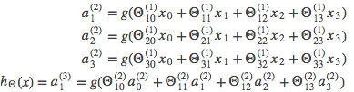
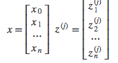
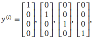

# Neural networks

## Neurons

- Dendrites: Input
- Axon: Output

## Logistic unit

- Data: Input
    + X0: Bias unit (X0 = 1)
- Hypothesis: Output
    + θ: Parameters, Weight
    + Sigmoid activation function

## Neural network

Group of neurons separated into layers

1. Layer 1: Data. Input layer
2. Layer 2: Activation units. Hidden layer
    - ai(j): Activation of unit i in layer j. These are features learnt by the network.
    - Θ(j): Matrix of weights controlling function mapping from layer j to layer j + 1
        + In a network with 3 units (Xs) and 3 hiddent units, θ is a 3x4 matrix
        + If network has s(j) units in layer j and s(j+1) units in layer j+1, then Θ(j) will be of dimension s(j+1) × s(j)+1
3. Layer 3: y. Output layer

Architecure: How layers and units are connected

### Vectorized implementation

zk(j): parameters inside g()

a(2)1=g(z(2)1)

a(2)2=g(z(2)2)

a(2)3=g(z(2)3)

Vector representation:

If we consider x = a(1):

z(j) = Θ(j−1) * a(j−1)

a(j)=g(z(j))

We can then add a bias unit (equal to 1) to layer j after we have computed a(j). This will be element a0(j) and will be equal to 1.

To compute finaly hypothesis:

z(j+1)=Θ(j)a(j)

hΘ(x)=a(j+1)=g(z(j+1))

### Multiclass classification

Hypothesis returns a vector of size = number of classes

