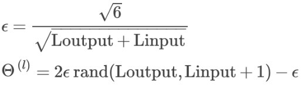

# Neural networks

## Cost function

- L = total number of layers
- sl = number of units (excluding bias unit) in layer `l`
- K = number of output units

- First part of the equation: For each feature, we loop over the output nodes
- Second part: 
    - We loop over all the Thetas (one per layer except the output layer)
    - We loop over the columns in the current matrix, which is equal to the number of nodes in our current layer, including the bias unit
    - We loop over the rows in the current matrix, which is equal to the number of nodes in the next layer

## Backpropagation algorithm

Minimizes the cost function

We need to compute the partial derivative of J(Θ)

For every node, we compute:

δ(l)j = "error" of node j in layer l. It is actually the derivative of the cost function

For the last layer, we compute:

δ(L) = a(L) - y        // L is total number of layers

We're calculating the differences of our actual results and the correct output y.

To get any other layer, we use an equation that steps from right to left:

δ(l) = ((Θ(l))T * δ(l+1)) .∗ g'(z(l))

g' is the derivative of the activation function g

g'(z(l))= a(l) .∗ (1 − a(l))

So the partial derivative of J(Θ) is:

The producesd matrix is the same dimension as Θ(l). The process produces a gradient term for every element in Θ(l).

### Algorithm

1. Training set { (x(1), y(1)) ... (x(m), y(m)) }
2. Set Δ(l)i,j := 0 for all (l, i, j)
3. For each training example t = 1 to m
    * Set a(1) := x(t)
    * Perform forward propagation to compute a(l) for l = 2, 3,…, L
    * Using y(t), compute δ(L) = a(L) − y(t)
    * Compute δ(L−1), δ(L−2), …, δ(2) using δ(l) = ((Θ(l))T * δ(l+1)) .∗ g'(z(l))
    * Δ(l)i,j := Δ(l)i,j + a(l)j * δ(l+1)i
        - or with vectorization, Δ(l) := Δ(l) + δ(l+1) * (a(l))T
4. D(l)i,j := (1 / m) * (Δ(l)i,j + λ * Θ(l)i,j)    // if j is not 0
5. D(l)i,j := (1 / m) * Δ(l)i,j                    // if j is 0

Δ(l)i,j is an accumulator

D(l)i,j are the partial derivatives

### Gradient checking

ϵ = 10 ^(−4)

This is used to check that backpropagation works as expected. It's an approximation of the derivative of the cost function.

We then check the value is roughly the same as δ

After checking once that all is fine, gradient checking should be deactivated, as it's really slow

### Random initialization

Intializing Θ(l)i,j to 0 won't work, as with backpropagation, nodes will always update to the same value, so we randomize weights to a value between [-ϵ,ϵ].

