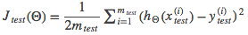
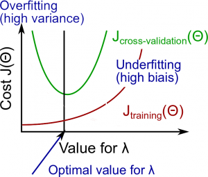

# Applying Machine Learning

## Evaluating a learning algorithm

Errors can be fixed by:

* More training examples. _Fixes high variance_
* Smallers sets of features. _Fixes high variance_ 
* Additional features. _Fixes high bias_
* Polynomial features. _Fixes high bias_
* Increasing λ. _Fixes high variance_ 
* Decreasing λ. _Fixes high bias_

To evaluate a hypothesis, we split the data into:

* Training set. To learn Θ and minimise J(Θ)
* Test set. Compute a more accurate error

Test set error:

1. Linear regression:

2. Classification

err(hΘ(x), y) =
    * 1 if hΘ(x) >= 0.5 and y = 0 OR hΘ(x) < 0.5 and y = 1
    * 0 otherwise

Average test error:

 

### Choosing polynomial degree

We add a *cross validation set* to calculate separate error values:

* Training set. To optimise Θ and minimise J(Θ) for each polynomial degree
* Cross validation set. Find _d_, polynomial degree with least error
* Test set. Estimate generalization error using Jtest(Θd)

### Bias vs Variance

* High bias: underfitting
* High variance: overfitting

The polynomial degree can affect this:

The parameter λ in regularization also contributes to it:

Test case size affects:

## System design

Approaches:

* Collect a lot of data
* Develop sophisticated features
* Algorithms to process inputs in different ways

Hard to tell which one so:

1. Start with simplest algorithm and test it
2. Plot learning curves
3. Error analysis on examplis in Cross Validation set and spot trends to assess approach

Error results should be single numerical value to assess algorithm performance

### Skewed classes

When our positive classes are very rare in a set. Makes it hard to tell if a reduction in error is an improvement in the algorithm

> _In predicting a cancer diagnoses where 0.5% of the examples have cancer, we find our learning algorithm has a 1% error. However, if we were to simply classify every single example as a 0, then our error would reduce to 0.5% even though we did not improve the algorithm._

We can use (the higher the better):

* Precision: Of all those predicted with y = 1, what fraction is truly of class 1
    - True positives / (True positives + False positives)
* Recall: Of all those of class 1, how many did we predict as y = 1
    - True positives / (True positives + False negative)

Trading off these values:

* Increasing threshold
    - Higher precision
    - Lower recall
* Decreasing threshold
    - Lower precision
    - Higher recall

#### F score (F1)

(2 * P * R) / (P + R)

For it to be large, both values must be large

### Amount of data

- Inferior algorithm, with enough data, sometimes outperforms superior algorithms with less data
- Features need to have enough information. Can an expert predict y with x?
- Low bias algorithm (many features or hidden units), the larger the training set, the less overfitting