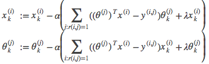

# Anomaly detection

Unsupervised learning, where, given a dataset, we want to know if a new example is abnormal

* We _model_ p(x): probability of an example being abnormal
* ϵ: threshold that divides abnormal examples from normal

## Gaussian distribution

Bell shaped curved described by _N(μ,σ2)_

x ~ N(μ, σ ^ 2): The probability distribution of x is Gaussian

* ~: distributed as
* μ: mean (center of the curve)
    - μ = (1 / m) * ∑ x(i)
* σ: standard deviation (width of the curve)
* σ ^ 2: variance
    - σ ^ 2 = (1 / m) * ∑ (x(i) − μ) ^ 2

## Algorithm

p(x) = p(x1; μ1, (σ^2)1) * p(x2; μ2, (σ^2)2) * ⋯ * p(xn; μn, (σ^2)n) = 
∏ p(xj; μj, (σ^2)j)

1. Choose features x1 that might indicate abnormal examples
2. Fit parameters μ1,...,μn and (σ^2)1, ..., (σ^2)n
3. Calculate μj
4. Calculate (σ^2)j
5. With new example x, compute p(x) = ∏ p(xj; μj, (σ^2)j)
6. Abnormal if  p(x) < ϵ

### Evaluation

* Take labeled data (y = 1 if abnormal, y = 0 if normal) where most of it is normal data
* Training set: 60% where all are normal
* Cross validation and test sets: 20% each that include some of the abnormal data
* Use cross validation set to choose ϵ
* Evaluate using F1 score

### Usage

Use anomaly detection:

* Many normal examples, few abnormal examples
* Many different types of anomalies 

Use supervised learning:

* Large number of both normal and abnormal examples
* Enough abnormal examples for the algorithm to figure out what they look like

### Picking features

* Check features are *gaussian* by plotting its histogram
* Apply transforms to get the bell shaped curve:
    - log(x)
    - log(x + c) _some constant_
    - sqrt(x)
    - x ^ (1 / 3)

If p(x) is similar for both normal and some abnormal examples, a new feature might be necessary that distinguishes the data better

_Choose features that might take on unusually large or small values in the event of an anomaly_

### Multivariate Gaussian distribution

We model p(x) in one go. Parameters will be μ ∈ ℝ ^ n and Σ ∈ ℝ ^ (n×n)

We can model elongated Gaussian contours so it fits non circular data better

Varying Σ changes the contour's:

* shape
* width
* orientation

The original model for p(x) corresponds to a multivariate Gaussian where the contours of p(x; μ, Σ) are axis-aligned

The multivariate Gaussian model can automatically capture correlations between different features of x

The original model is computationally cheaper (no Σ ^ (-1))

In the multivariate distribution, training set size needs to be larger than the number of features for Σ to be invertible

## Recommender systems

* nu: number of users
* nm: number of movies
* r(i, j): 1 if user j has seen movie i
* y(i, j): rating given by user j to movie i

Our features (x1, x2, ..., xm) will be a value between 0 and 1 meaning how much a movie (or other element) has of that feature (how much action a movie has, or romance)

We can use linear regression:

* θ(j): parameter vector for user j
* x(i): feature vector for movie i
* m(j): number of movies rated by user j
* (θ(j))' * (x(i)): For user j, predict rating for movie i

To get the parameters for one user:

To get the parameters for all users:

We removed the constant *(1 / m)*

We only pick i that `r(i, j) = 1`

### Collaborative featuring

To figure out features, we can do it from a parameter vector

We can create a random parameter vector, and keep minimizing both functions in turn to get a good t of features

We can combine them to speed things up:

Bias units are now not necessary

1. Initialize x(i), ..., x(nm), θ(1), ..., θ(nu) to small random values. This serves to break symmetry and ensures that the algorithm learns features x(i), ..., x(nm) that are different from each other
2. Minimize J(x(i), ..., x(nm), θ(1), ..., θ(nu))

3. Predict a rating with θ'x

### Vectorisation

Y = X * Θ'

Predicting how similar movies _i_ and _j_ are, we check the distance between their feature vectors:

∣∣x(i) − x(j)∣∣

### Mean normalization

Using this, for new users, θ will be assigned to 0 due to the regularization term

We'll normalize the data relative to the mean

Vector μ = [μ1, μ2, …, μ3]:

μi = ∑(j:r(i,j)=1) Y(i, j) / ∑(j) r(i,j)

It's the mean of the previous ratings for movie i

We normalize substracting the mean from the actual rating

(θ(j))' * x(i) + μi

Instead of 0, for a new user, the rating of a movie will be the mean